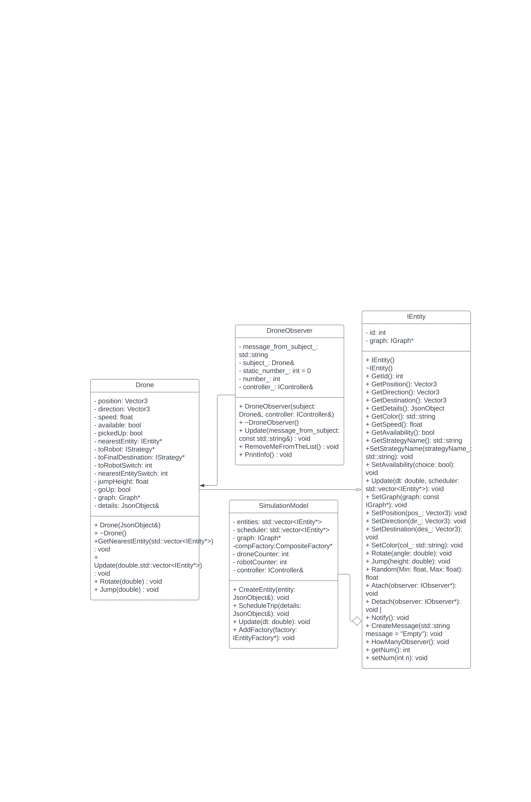

# Team 29
Danial Syed(syed0053), Taha Rao(rao00041), Bach Tran(tran1003), Ibrahim Hosh(hosh0013)

# Project Overview
This project is a simulation of a drone delivery system with a rough replica of the University of Minnesota Twin Cities Campus. It allows users to schedule trips for drones to pickup robots based off a search name (traversal algorithm) and the start and finish locations of the trip. The simulation allows users to see the drone take its course in picking up the robot and dropping it off at the final destination. Our extensions notifies the user of the progress of this process using the notification bar on the left hand side of the simulation screen and extracts data from the system into a csv file for system analysis.

# How to run with codebase
    // Move into Project location
    cd /path/to/repo/project
    // Run the makefile
    make -j
    // Build the system and environment
    ./build/bin/transit_service 8081 apps/transit_service/web/
    // Open simulation
    Navigate to http://127.0.0.1:8081 and you should see a visualization.
    //Schedule trips
    Navigate to http://127.0.0.1:8081/schedule.html and you should see a page to schedule the trips.

# How to run with Docker
    // this builds the image and creates the container
    docker build -t raotaha1/homework . 
    // this runs the actual project
    docker run --rm -it -p 8081:8081 raotaha1/homework
    // Open simulation
    http://127.0.0.1:8081
    // Schedule Trips
    http://127.0.0.1:8081/schedule.html
    //To exit the Docker project in the terminal
    hit ctrl + p + q
    //To Kill the container
    docker kill
# Code overview
This is a full stack project that enables C++ code in the backend to receive input from our frontend which is made from a mix of HTML and Javascript. Users are able to add trips to the simulation using our frontend UI which will schedule a trip for a drone to take allowing the user to pick the path and travel method it takes. Users also have the ability to add humans whom can roam around freely, as well as speed up the simulation in the top left hand corner.

# Extensions
    Feature 1: Displaying Notifications
        Displays notifications to the frontend UI on the left hand side to notify the user of the following: 
            - The drone has started its route to pick up the robot
            - The drone has picked up the robot
            - The drone has started its route to deliver the robot to its final destination
            - The drone has delivered the robot to its final destination
        This feature is significantly interesting since it updates the user with the status of the drone that was scheduled. Thus, there is no need to endlessly follow the drone and see where its current location is. Notifications can practically serve as checkpoints that allow the user to know how far the drone has gotten up until that point.
        This feature added onto the existing work by becoming more user friendly with regards to updating the user with the status of the drone. 
        We chose the observer design pattern as it allows our drone object to update and notify us with its current status. Another reason we chose this design pattern is because it was minimal and did not tamper too much with the already existing implementation of the project which lowers risk of error.
        In order to observe this feature, schedule a trip as you normally would and it will automatically send notifications to the front end UI on the left hand side of the simulation screen. In order to schedule a trip, follow the "How to run" instructions" and head to http://127.0.0.1:8081/schedule.html. From there, enter a name, choose a search strategy, and pinpoint on the map a start and end location. Click "Schedule Trip" and the head back to the simulation (http://127.0.0.1:8081) and you will notice the notifications appearing on the left hand side

    Feature 2: Data Collection 
        Collects direction and position for x, y, and z coordinates as well as the speed and color of different instances in time of the drone as well as the average speed and total distance for the robot and appends this data to a .csv file which is available for observation.
        This feature is signficantly interesting as it allows users to observe the different data elements of the drone and robot and can be used for further analysis such as how efficient different traversal algorithms are.
        This feature adds onto the existing work as it allows for further analysis of the different locations a user can schedule for a trip as well as the different traversal algorithms.
        We used a Singleton design pattern as it allowed us to call a single object and consistently write to our .csv file with new data that needed to be entered. Similar to observer, this didn't disturb the preexisting system and only added onto to it. 
        In order to use this feature, run the simulation with at least one fully completed scheduled trip (you'll know when that trip is done from the notifications on the left hand side). Once complete, you'll be able to access a newly generated file called "data.csv". We recommend opening the file with Microsoft Excel or Google Sheets as they use commands specific to those tools. From there, you'll be able to observe the various amounts of data that was collected. 

# Sprint retrospective
    What went well:
        Group was very well organized and it was clear everyone knew what we were working on
        Group communicated well to update others with current progress
    What went poor:
        More meetings could have been made to teach others of new findings
        Difficult to divide up work evenly with constant aid being needed (specifically with regards to the coding)
    What we would change:
        Have a proper timeline of when a task should be done
        Be more of an outlet for other team members to reach out to if stuck

# UML extension diagrams: 
Notifications:

 

CSV extension

 

# Youtube Demo: 
https://youtu.be/rMZ8EDcK30c

# Docker:
https://hub.docker.com/r/raotaha1/homework

